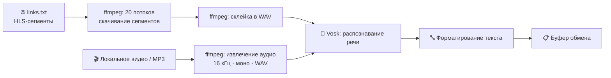

<div align="center">

# 🎬 Subbtitles

**Офлайн-расшифровка видео и аудио в текст на движке Vosk**

Извлекает звук, распознаёт речь без интернета, аккуратно форматирует результат и кладёт его в буфер обмена.


[Что это](#-что-это-такое) • [Возможности](#-возможности) • [Как работает](#-как-это-работает) • [Установка](#-установка) • [Использование](#-использование) • [Структура](#-структура-проекта) • [FAQ](#-faq)

</div>

---

## 📖 Что это такое

**Subbtitles** — набор Python-скриптов для **локальной (офлайн) расшифровки** видео и аудио в текст: быстрая заготовка субтитров, транскриптов и конспектов.

Работает на движке распознавания речи [Vosk](https://alphacephei.com/vosk/) и `ffmpeg`. Интернет не требуется — всё считается на твоём компьютере, ничего никуда не отправляется.

> [!NOTE]
> В этом репозитории лежит **только исходный код**. Полный рабочий набор — `ffmpeg.exe`, `yt-dlp.exe`, модели распознавания и пример записи — лежит в [**Releases → v1.0**](https://github.com/NOTyeamu/Subbtitles/releases/tag/v1.0) (файл `subbtitles.rar`).

---

## ✨ Возможности

- 🎞 **Два источника**: локальный файл (`.mp4` / `.mp3`) или HLS-поток по ссылкам сегментов.
- 🧠 **Полностью офлайн** — движок Vosk, никаких API и подписок.
- 🌍 **Два языка из коробки**: русский (`vosk-model-small-ru-0.22`) и английский (`vosk-model-small-en-us-0.15`).
- ⚡ **Быстрое скачивание** HLS в **20 потоков** одновременно (`ex.py`).
- 🔤 **Умное форматирование**: заглавная буква в начале строки, имена собственные с большой буквы, точка в конце.
- 📋 **Буфер обмена**: готовый текст сразу копируется — вставляй куда угодно.
- 🖱 **Запуск в один клик** через `.bat`-файлы (выбор файла по номеру).

---

## ⚙️ Как это работает



1. **Аудио** приводится к виду, который понимает Vosk: `16 кГц`, моно, `WAV`.
2. **Vosk** прогоняет поток через модель языка и отдаёт куски текста.
3. **Форматтер** чистит текст и собирает его в читаемый вид.
4. Результат печатается в консоль и **копируется в буфер обмена**.

---

## 📦 Требования

| Компонент | Назначение |
| :--- | :--- |
| **Windows 10/11** | `.bat`-лаунчеры написаны под Windows |
| **Python 3.8+** | запуск скриптов |
| **[Vosk](https://pypi.org/project/vosk/)** | движок распознавания речи |
| **[pyperclip](https://pypi.org/project/pyperclip/)** | работа с буфером обмена |
| **ffmpeg** | извлечение и конвертация аудио |
| **Модель Vosk** | `vosk-model-small-ru-0.22` и/или `vosk-model-small-en-us-0.15` |

---

## 🚀 Установка

**1. Скачай полный набор** из [Releases → v1.0](https://github.com/NOTyeamu/Subbtitles/releases/tag/v1.0) и распакуй `subbtitles.rar`.

**2. Установи Python-зависимости:**

```bash
pip install vosk pyperclip
```

**3. Убедись, что рядом лежат `ffmpeg.exe` и папка с моделью** (обе есть в архиве релиза). Скрипты вызывают `ffmpeg` по имени — Windows найдёт его в текущей папке.

<details>
<summary><b>Нет моделей? Скачай вручную</b></summary>

<br>

Модели не входят в этот репозиторий (слишком большие). Скачай и положи папку рядом со скриптами:

- 🇷🇺 Русская — `vosk-model-small-ru-0.22`
  `https://alphacephei.com/vosk/models/vosk-model-small-ru-0.22.zip`
- 🇺🇸 Английская — `vosk-model-small-en-us-0.15`
  `https://alphacephei.com/vosk/models/vosk-model-small-en-us-0.15.zip`

Имя папки должно совпадать с именем, указанным в `.bat`-файле.

</details>

---

## 🕹 Использование

### Способ 1 — локальный файл 🎞

1. Положи `.mp4` или `.mp3` в папку проекта.
2. Запусти нужный лаунчер:

| Файл | Модель | Когда использовать |
| :--- | :--- | :--- |
| `rus_start.bat` | 🇷🇺 русская | русская речь |
| `eng_start.bat` | 🇺🇸 английская | английская речь |

3. Введи **номер** файла из списка и нажми Enter.
4. Готовый текст появится в консоли и **скопируется в буфер обмена**.

### Способ 2 — HLS-поток по ссылкам 🌐

Пригодится, когда видео разбито на сегменты (`.ts`) и есть плейлист.

1. Открой `links.txt` и вставь ссылки на сегменты (или целиком `#EXTM3U`-плейлист).
2. Запусти `start_ex.bat`.
3. Скрипт скачает все сегменты в **20 потоков**, склеит их и расшифрует.

### Способ 3 — вручную из консоли ⌨️

```bash
# Локальный файл: <видео> <модель>
python main.py video.mp4 vosk-model-small-ru-0.22

# Поток по ссылкам: <файл со ссылками> <модель>
python ex.py links.txt vosk-model-small-ru-0.22
```

> [!TIP]
> Чем длиннее запись, тем дольше распознавание — на CPU это почти линейная зависимость от длительности. Короткие клипы расшифровываются за секунды.

---

## 📁 Структура проекта

```
Subbtitles/
├── main.py            # расшифровка локального видео/аудио
├── ex.py              # многопоточная расшифровка HLS-сегментов по ссылкам
├── rus_start.bat      # лаунчер: main.py + русская модель
├── eng_start.bat      # лаунчер: main.py + английская модель
├── start_ex.bat       # лаунчер: ex.py + русская модель
├── links.txt          # список ссылок на сегменты (пример плейлиста)
└── README.md
```

> Файлы `ffmpeg.exe`, `yt-dlp.exe`, папки моделей `vosk-model-*` и пример видео **не хранятся в git** (см. `.gitignore`) — они лежат в архиве релиза.

---

## ❓ FAQ

<details>
<summary><b><code>ffmpeg не найден</code> / <code>Ошибка ffmpeg</code></b></summary>

<br>

`ffmpeg.exe` должен лежать **в той же папке**, откуда запускается `.bat`, либо быть добавлен в `PATH`. Возьми бинарник из архива релиза.

</details>

<details>
<summary><b><code>Model folder not found</code></b></summary>

<br>

Папка модели отсутствует или названа иначе. Скачай модель (см. раздел «Установка») и проверь, что имя папки совпадает с `set "model=..."` в `.bat`-файле.

</details>

<details>
<summary><b><code>ModuleNotFoundError: No module named 'vosk' / 'pyperclip'</code></b></summary>

<br>

Не установлены зависимости. Выполни:

```bash
pip install vosk pyperclip
```

</details>

<details>
<summary><b>Текст получается с ошибками</b></summary>

<br>

Используй модель **побольше** (не `small`), если нужна точность — список моделей есть на [alphacephei.com/vosk/models](https://alphacephei.com/vosk/models). Также помогает более чистый звук без музыки и шума.

</details>

<details>
<summary><b>Ничего не скопировалось в буфер</b></summary>

<br>

`pyperclip` на Windows работает через системный буфер. Если запускаешь из среды без доступа к буферу обмена, текст всё равно будет выведен в консоль — скопируй вручную.

</details>

---

## 📝 Заметки

- Распознавание идёт **на CPU**; GPU не используется.
- Форматтер знает список распространённых имён и автоматически ставит их с заглавной буквы.
- Проект заточен под личное использование и Windows.

## 📄 Лицензия

Лицензия не указана. Все права принадлежат автору — [@NOTyeamu](https://github.com/NOTyeamu).

<div align="center">

---

Сделано с ❤️ и [Vosk](https://alphacephei.com/vosk/)

</div>
